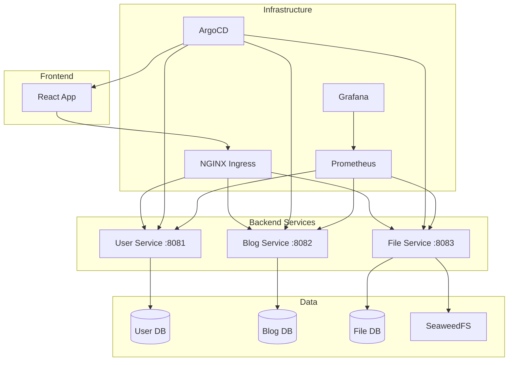
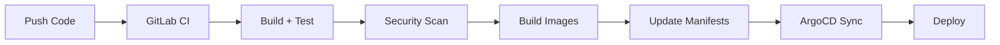
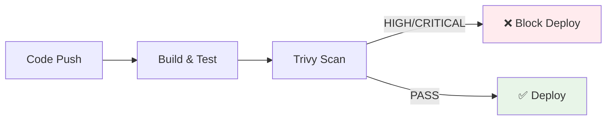

# Blog Platform

A microservices-based blog application built for the NT548.Q21 DevOps course. The project demonstrates GitOps deployment, CI/CD pipelines, container orchestration, and monitoring practices.

## Overview

**Technology Stack:**

| Component | Technology | Purpose |
|-----------|------------|---------|
| **Frontend** | React + Vite + Tailwind CSS + NGINX | Modern SPA with responsive UI |
| **Backend** | Spring Boot (Java 17) + PostgreSQL | Microservices with individual databases |
| **Storage** | SeaweedFS | Distributed file storage system |
| **Orchestration** | Kubernetes (k3d) | Container orchestration with resource management |
| **GitOps** | ArgoCD | Automated deployment with self-healing |
| **CI/CD** | GitLab CI/CD | Security scanning, quality gates, parallel builds |
| **Monitoring** | Prometheus + Grafana | Metrics collection and visualization |
| **Ingress** | NGINX Ingress Controller | TLS termination and load balancing |

## Architecture



## Service Architecture

**Service Design Principles:**
- **Single Responsibility**: Each service owns its domain
- **Database per Service**: Independent data management
- **API-First**: REST APIs with comprehensive health endpoints
- **Containerized**: Multi-stage Docker builds for optimization

### Service Mapping

| Service | Port | Database | Responsibilities |
|---------|------|----------|-----------------|
| **User Service** | 8081 | user_db | Authentication, user management, JWT tokens |
| **Blog Service** | 8082 | blog_db | Posts, comments, likes, categories |
| **File Service** | 8083 | file_db | File uploads, SeaweedFS integration |
| **Frontend** | 3000 | - | React SPA, API orchestration |

## Quick Start

**⚡ Setup Time: ~5 minutes with Docker Desktop**

### Prerequisites

- Docker Desktop (4GB+ memory)
- `k3d`, `kubectl` CLI tools
- GitLab account with Personal Access Token

### Setup

```bash
# 1. Create cluster and install ArgoCD
bash scripts/k3d-setup.sh
bash scripts/argocd-install.sh

# 2. Create GitLab registry secret
kubectl create secret docker-registry gitlab-registry \
  --namespace blog-app \
  --docker-server=registry.gitlab.com \
  --docker-username=YOUR_GITLAB_USER \
  --docker-password=YOUR_GITLAB_PAT \
  --docker-email=YOUR_EMAIL

# 3. Deploy applications
kubectl apply -f argocd/project.yaml
kubectl apply -f argocd/blog-app.yaml
kubectl apply -f argocd/monitoring.yaml
```

Add to your hosts file (`/etc/hosts` or `C:\Windows\System32\drivers\etc\hosts`):
```
127.0.0.1 argocd.local
```

### Access

| Service | URL | Notes |
|---------|-----|-------|
| ArgoCD | `https://argocd.local:8443` | Get password: `kubectl -n argocd get secret argocd-initial-admin-secret -o jsonpath="{.data.password}" \| base64 -d` |
| Frontend | `http://localhost:3000` | `kubectl port-forward -n blog-app svc/frontend 3000:80` |
| Grafana | `http://localhost:3001` | `kubectl port-forward -n monitoring svc/grafana 3001:3000` |

## Project Structure

```
backend/                    # Spring Boot microservices
├── user-service/          # Authentication, user management
├── blog-service/          # Posts, comments, likes
└── file-service/          # File uploads, SeaweedFS integration

frontend/                   # React SPA (Vite + Tailwind)

k8s/
├── base/                  # Base Kubernetes manifests
├── overlays/dev/          # Dev environment overrides
└── monitoring/            # Prometheus + Grafana

argocd/                    # GitOps configuration
├── project.yaml           # ArgoCD project
├── blog-app.yaml          # Main app deployment
└── monitoring.yaml        # Monitoring stack

scripts/
├── k3d-setup.sh           # Cluster setup
└── argocd-install.sh      # ArgoCD installation

.gitlab-ci.yml             # CI/CD pipeline
```

## Development

### Local Development (without Kubernetes)

```bash
docker-compose up -d

# Services available at:
# Frontend:     http://localhost:5173
# User API:     http://localhost:8081
# Blog API:     http://localhost:8082
# File API:     http://localhost:8083
```

### GitOps Workflow



1. Push code to GitLab
2. CI pipeline builds, tests, and scans for vulnerabilities
3. On success, pipeline updates image tags in `k8s/base/kustomization.yaml`
4. ArgoCD detects changes and deploys automatically

## Key Features

### CI/CD Pipeline
- Multi-stage builds with caching
- Trivy vulnerability scanning (blocks HIGH/CRITICAL)
- Automatic image tagging and manifest updates
- Parallel job execution

### Security

**Security Scanning Pipeline:**


**Security Controls:**
- 🔒 **Vulnerability Scanning**: Trivy blocks HIGH/CRITICAL vulnerabilities
- 🛡️ **Pod Security Standards**: Restricted mode with non-root containers
- 🔐 **Network Policies**: Service isolation at network level
- 🔑 **Secrets Management**: Kubernetes secrets, never in Git
- 📊 **Audit Trail**: Complete deployment history via Git + ArgoCD

### Monitoring & Observability

**Metrics Collection:**
- **Application Metrics**: Spring Boot Actuator via `/actuator/metrics`
- **Health Endpoints**: `/actuator/health` (liveness/readiness probes)
- **JVM Monitoring**: Memory, GC, threads via Micrometer
- **Custom Metrics**: API response times, error rates, business metrics

**Available Dashboards:**
- Application Overview (service health, request rates)
- JVM Performance (heap usage, GC performance)
- Database Monitoring (connection pools, query performance)
- Kubernetes Resources (pod status, resource utilization)

## Troubleshooting

| Problem | Solution |
|---------|----------|
| `ImagePullBackOff` | Check GitLab registry secret: `kubectl get secret gitlab-registry -n blog-app` |
| ArgoCD out of sync | Force sync: `argocd app sync blog-app --force` |
| Pods not starting | Check events: `kubectl get events -n blog-app --sort-by=.metadata.creationTimestamp` |
| Database connection errors | Wait for DB pods to be ready, services will retry automatically |

### Useful Commands

```bash
# Check pod status
kubectl get pods -n blog-app

# View logs
kubectl logs -n blog-app deployment/user-service -f

# Check ArgoCD apps
kubectl get applications -n argocd

# Force restart
kubectl rollout restart deployment/user-service -n blog-app

# Delete cluster
k3d cluster delete blog-dev
```

## Documentation

- [Security](docs/SECURITY.md) - Security controls & compliance
- [Backup & Recovery](docs/BACKUP_RECOVERY.md) - Disaster recovery procedures
- [Contributing](docs/CONTRIBUTING.md) - Development guidelines

## Project Info

| | |
|---|---|
| Course | NT548.Q21 - DevOps |
| Last Updated | 2026-03-25 |
